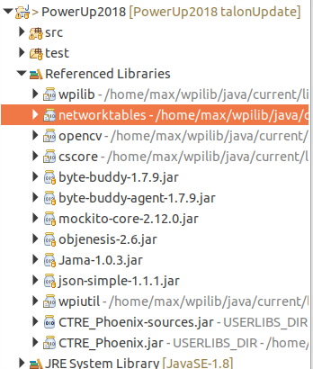

# PowerUp2018
Code for team 2984's 2018 season

# Contributing
To contribute first clone the project into a folder by running:
```bash
mkdir PowerUpWorkspace
cd PowerUpWorkspace
git clone https://github.com/{username}/PowerUp2018.git
```
Then open eclipse and set the workspace to PowerUpWorkspace.
Once Eclipse is open create a new "Robot Java Project" with the name PowerUp2018 and set the package to org.ljrobotics.frc2018.

Next, add the JUnit Library to the build path by right clicking on the PowerUp2018 project, selecting "Properties". Then in the popup window select "Java Build Path" from the left menu and click on "Add Library". Select JUnit 5 from the dropdown and click finish.

After that click on "Add JARs" and select all the JARs in the libs folder. To do this expand the Powerup2018 folder and then expand the libs folder in the popup window.

Finally hit "Apply and Close" to close out of this dialog.

This completes adding of libraries excluding NetworkTables. To add network tables you must compile it, instructions can be found at [https://github.com/wpilibsuite/ntcore](https://github.com/wpilibsuite/ntcore). Once you have it compiled open up Java Build Path in the properties window. Then, click on the Libraries tab. In the libraries tab, find where it says network tables. Click on the arrow pointing right to the left of it. Once the menu opens up, double click on Native Library Folder Configuration. Click on external folder. Select native library location and browse to ntcore/build/libs/ntcoreJNI where ntcore is the git repository you cloned earlier. These package explorer is depicted below.



Now you are all setup to start programming. Make sure to write unit tests for any code you write.

# To upload
Connect to the roborio with usb or to the robots WIFI.

Run nm-connection-editor and add a shared connection if it doesn't connect to wired automatically

Click 'run as > WPILib deploy' in the right click menu in Eclipse. 
